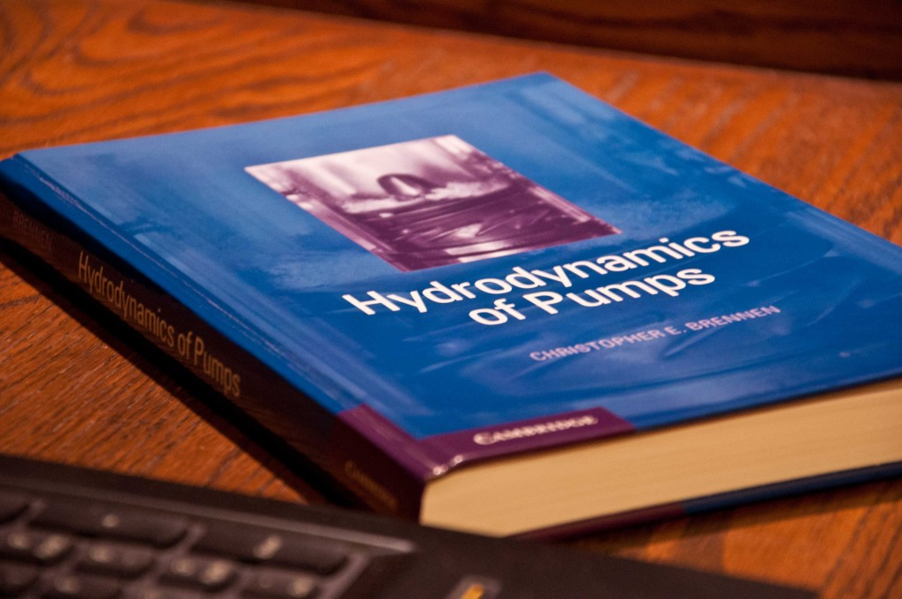

*Copyright © Randal Ferman*

# Mathematical Hydrodynamics #

The present repository is a freely available copy of lecture notes on the Mathematical Hydrodynamics with a particular emphasis on variational methods. Basically, this material has been gathered together to serve as students's support for various lectures that the Author has been invited to deliver. The manuscript is currently *constantly evolving*. So, please, check this web page from time to time for the updated versions.

Moreover, if you have any questions, suggestions or corrections to this document, please do not hesitate to contact the Author (preferably by e-mail).

---

### Author ###

* Dr. [Denys Dutykh](http://www.denys-dutykh.com/) ([CNRS](http://www.cnrs.fr/) - [INSMI](http://www.cnrs.fr/insmi/) - [LAMA UMR #5127](http://www.lama.univ-savoie.fr/index.php) - [Université Savoie Mont Blanc](http://www.univ-savoie.fr/))
* Home page: [http://www.denys-dutykh.com/](http://www.denys-dutykh.com/)
* E-mail: " Denys . Dutykh at univ-savoie . fr "

---

### Acknowledgements ###

The contributions of these people are greatly acknowledged:

* Prof. [Didier Clamond](http://math.unice.fr/~didierc/) ([LJAD](http://math.unice.fr/) - [Université de Nice Sophia Antipolis](http://unice.fr/), France)
* Dr. [Dimitrios Mitsotakis](https://sites.google.com/site/dmitsot/) ([School of Mathematics, Statistics and Operations Research](http://www.victoria.ac.nz/smsor/) - [Victoria University of Wellington](http://www.victoria.ac.nz/), New Zealand)
* Dr. [Ashkan Rafiee](https://au.linkedin.com/pub/ashkan-rafiee/80/205/403) ([Carnegie Wave Energy](http://www.carnegiewave.com/) - Australia)

---

### Changelog ###

V0.0.2: 2015/04/08

* Derivation of basic Fluid Mechanics equations in the Eulerian description
* Appendix on differential forms

V0.0.1: 2014/11/21

* The very first preliminary structure of the book.